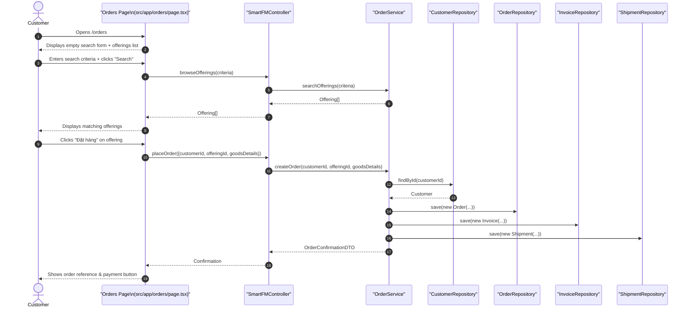
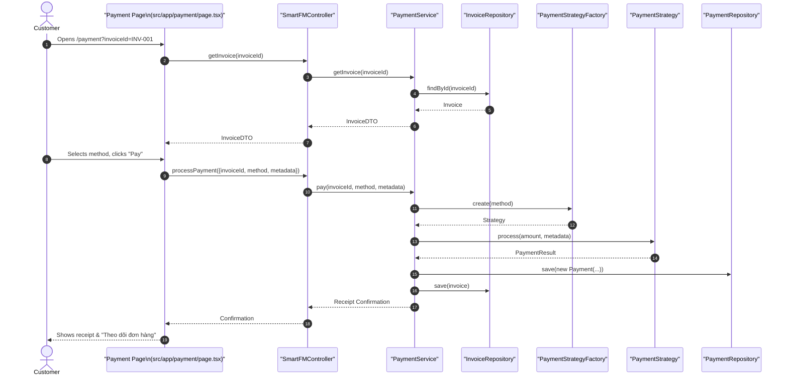
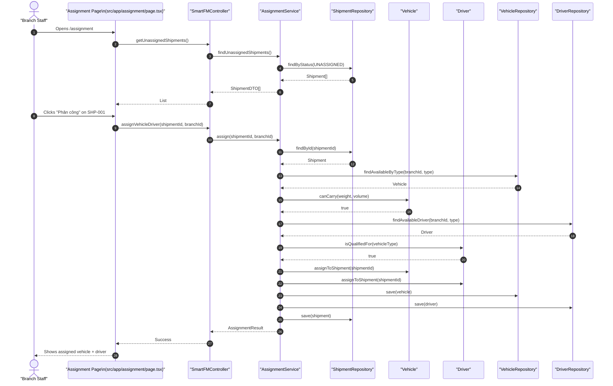
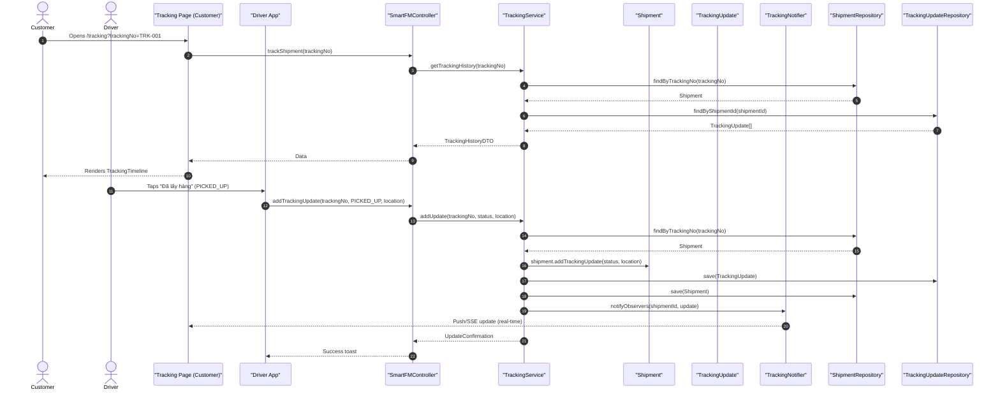

# Sequence Diagrams (Mermaid) — Master Reference

> [!IMPORTANT]
> **Authoritative Detailed Files**: Individual `.mmd` files contain the complete, 5-scenario sequence flows (Empty UI, Correct input, Validation, Change of mind, Success) and precise design pattern mappings:
> - [SEQ-V1-ORDER.mmd](file:///f:/github-project/SG3_2-Assignment3_Object_Design/docs/planning_temporary/working/SEQ-V1-ORDER.mmd) — Browse → Search → Place Order
> - [SEQ-V2-PAYMENT.mmd](file:///f:/github-project/SG3_2-Assignment3_Object_Design/docs/planning_temporary/working/SEQ-V2-PAYMENT.mmd) — Payment Processing (with Strategy Pattern & PaymentStrategyFactory)
> - [SEQ-V3-ASSIGNMENT.mmd](file:///f:/github-project/SG3_2-Assignment3_Object_Design/docs/planning_temporary/working/SEQ-V3-ASSIGNMENT.mmd) — Assign Vehicle & Driver (Information Expert)
> - [SEQ-V4-TRACKING.mmd](file:///f:/github-project/SG3_2-Assignment3_Object_Design/docs/planning_temporary/working/SEQ-V4-TRACKING.mmd) — Track Shipment (Real-Time Observer Pattern)

---

## 1. Seq-V1: Browse → Search → Place Order

---

## 2. Seq-V2: Payment Processing

---

## 3. Seq-V3: Assign Vehicle & Driver

---

## 4. Seq-V4: Track Shipment

